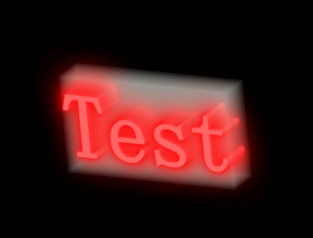
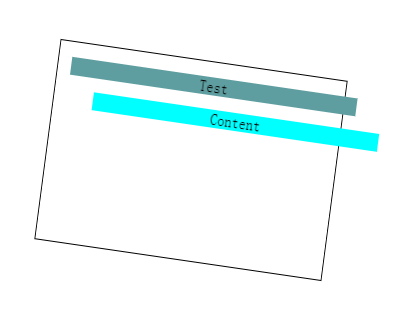

# Css 立体文字

*   多个文字重合排列
*   transform-style: preserve-3d属性

~~~ html

        <h1>Test</h1>
        <h1>Test</h1>
        <h1>Test</h1>
        <h1>Test</h1>
        <h1>Test</h1>
        <h1>Test</h1>
        <h1>Test</h1>
        <h1>Test</h1>
        <h1>Test</h1>
        <h1>Test</h1>

~~~

~~~ css
body{
    background-color: black;
}
.box{
    margin: 100px;
    animation: anim 5s ease-in-out infinite;
    transform-style: preserve-3d;
}
.box h1{
    position: absolute;
    font-size: 120px;
    background-color: rgba(213, 235, 225,.1) ;
    color: rgba(255, 100, 100, 1);
    text-shadow: 
        0 0 5px rgba(255, 0, 0, 1), 
        0 0 20px rgba(255, 0, 0, .8), 
        0 0 50px rgba(255, 0, 0, .6);
}
@keyframes anim {
    0%,
    100% {
        transform: rotate3d(1, 1, 0, 40deg);
    }
    25% {
        transform: rotate3d(-1, 1, 0, 40deg);
    }
    50% {
        transform: rotate3d(-1, -1, 0, 40deg);
    }
    75% {
        transform: rotate3d(1, -1, 0, 40deg);
    }

}
.box h1:nth-child(2){
    transform: translateZ(5px);
}
.box h1:nth-child(3){
    transform: translateZ(10px);
}
.box h1:nth-child(4){
    transform: translateZ(15px);
}
.box h1:nth-child(5){
    transform: translateZ(20px);
}
.box h1:nth-child(6){
    transform: translateZ(25px);
}
.box h1:nth-child(7){
    transform: translateZ(30px);
}
.box h1:nth-child(8){
    transform: translateZ(35px);
}
.box h1:nth-child(9){
    transform: translateZ(40px);
}
.box h1:nth-child(10){
    transform: translateZ(45px);
}

~~~

# CSS 视差效果

~~~html

        
Test

        Content
    

~~~

~~~ css
.box{
    border: 1px solid black;
    width: 320px;
    height: 200px;
    margin: 200px auto;
    text-align: center;
    transform-style: preserve-3d;
    animation: anim 3s infinite alternate;
}
.box p{
    transform: translateZ(30px);
    background-color: cadetblue;
}
.box span{
    display: block;
    transform: translateZ(90px);
    background-color: aqua;
}
@keyframes anim {
    0%{
        transform:rotate3d(0,1,.3,40deg);
    }
    100%{
        transform: rotate3d(0,1,.3,-40deg);
    }
}
~~~

