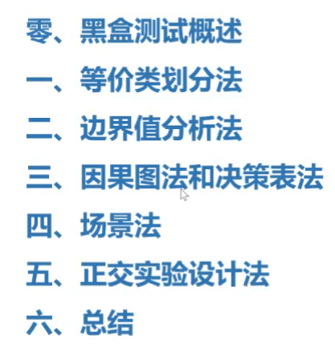
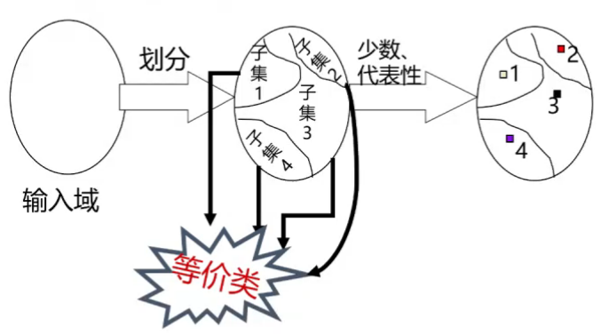
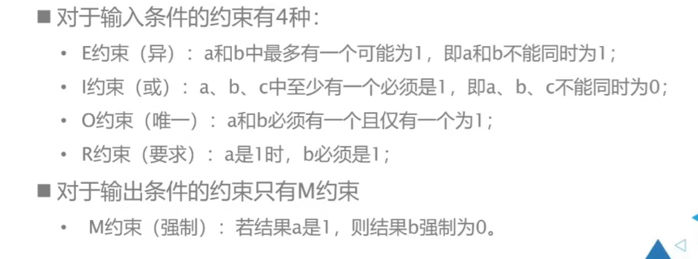

# 黑盒测试

黑盒测试属于穷举输入测试方法。

## 测试用例的定义

1.   测试用例是特定的目的而设计的一组测试输入，执行条件和预期的结果。
2.   测试用例是执行的最小实体。

#### 特征

1.   最有可能抓住错误
2.   不是重复的，多余的
3.   一组相似的测试用例中最有效的
4.   既不是太简单，也不是太复杂

### 测试用例的基本准则

*   代表性
*   可判断性
*   可再现性

## 等价类划分法

一个程序将**输入需求**分类成若干个**等价类**，选择**有代表性**的数据设计测试用例

### 原因

因为穷举测试的不可能性，所以只能从大量可能的数据中选取小部分作为测试用例。

>   *   有效等价类：有意义的、合理的输入数据所构成的集合
>   *   无效等价类：无意义的、不合理的输入数据所构成的集合。

## 等价类划分法设计测试用例的步骤

1.   确定等价类
2.   建立等价类表，列出所有划分出的等价类
3.   从划分出的等价类中按以下原则设计测试用例
     1.   为每个等价类规定唯一的编号。
     2.   尽可能多的覆盖未覆盖的有效等价类。（少而全）
     3.   仅覆盖一个尚未被覆盖的无效等价类。（多且专）

## 边界值分析法

## 因果图法和决策表法

决策表可以将复杂的问题按照各种可能的情况全部列举出来。

### 决策表的组成部分

*   条件桩：通常先后顺序是无关紧要的。
*   条件项：条件桩的所有可能的取值。
*   动作桩：问题可能采取的操作。
*   动作项：可能采取的动作。

### 决策表生成规则

1.  确定规则个数，n个条件，2^n^.
2.  列出所有的条件桩和动作桩。
3.  填入条件桩
4.  填入动作桩，得到初始决策表
5.  简化决策表

## 事件触发

### 基本流和备选流

 

